# ServiceNow Ticket Analysis (Batch & Real-time) with Microsoft Fabric  
## Table of Contents  
- [Project Overview](#project-overview)  
- [Data Sources](#data-sources)  
- [Tools](#tools)  
- [Architecture & Steps](#architecture--steps)  
- [Results/Findings](#resultsfindings)  
- [Recommendations](#recommendations)  
- [Limitations](#limitations)  
- [References](#references)
- [Dashboards](#dashboards)
- [Author](#author)
---
### Project Overview  
This project focuses on analyzing IT Service Management (ITSM) tickets from **ServiceNow**, using both **batch** and **real-time** data processing in **Microsoft Fabric**.  
The goal is to provide timely and actionable insights to improve incident resolution, resource allocation, and service efficiency.  
---
### Data Sources  
- **ServiceNow REST API** – Used to gather ticket data directly from the ServiceNow platform.  
- **Azure Event Hubs** – For real-time event streaming of ServiceNow data.  
---
### Tools 
- **ServiceNow REST API** – Data extraction and ingestion from ServiceNow platform.
- **Microsoft Fabric Lakehouse** – Storage & Medallion architecture (Bronze, Silver, Gold).  
- **Microsoft Fabric Notebooks (PySpark)** – Data ingestion, cleaning, and transformation.  
- **SQL Analytics Endpoint** – Querying and modeling data.  
- **Power BI** – Dashboarding and visualization.  
- **Data Activator** – Trigger-based alerts and actions.  
- **Microsoft Purview** – Governance and data catalog.  
---
### Architecture & Steps  

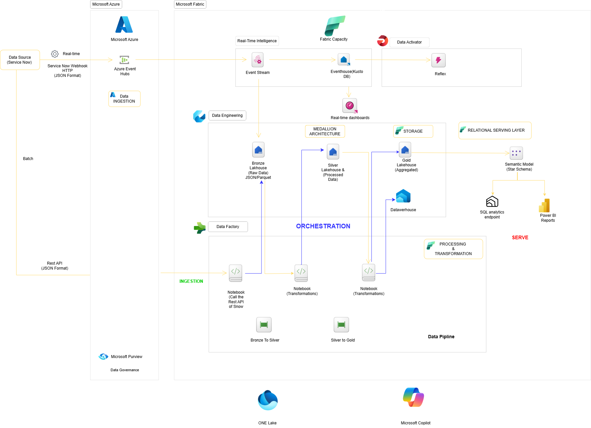
1. **Data Ingestion**  
   - Batch ingestion from ServiceNow REST API into Fabric Lakehouse (Bronze).  
   - Real-time ingestion via Azure Event Hubs.  
2. **Data Transformation**  
   - Cleaned and standardized tickets in **Silver** layer using PySpark.  
   - Created fact and dimension tables in **Gold** layer (semantic model, star schema).  
   - Transformation notebooks:  
     - [From Bronze to Silver (Mep & Demandes)](Mep&Demandes/From_Bronze_to_Silver[1].py)  
     - [From Silver to Gold (Mep & Demandes)](Mep&Demandes/transform_from_silver_to_gold[1].py)  
     - [Transform Data for Silver (Incidents)](mon_dossier/Transform_data_for_silver[1].py)  
     - [Transform Data for Gold (Incidents)](mon_dossier/Transform_data_for_gold_(1)[1].py)    
3. **Data Analysis & Visualization**  
   - Built automated dashboards in **Power BI**.  
   - Key KPIs: average resolution time, open vs. closed tickets, SLA compliance.  
4. **Automation & Governance**  
   - Implemented lineage & governance with **Microsoft Purview**.  
   - Configured **Data Activator** for real-time triggers (e.g., SLA breach alerts).
  
     📌 **Screenshot Example of Incidents Dashboard:**
     
   **General Page:**

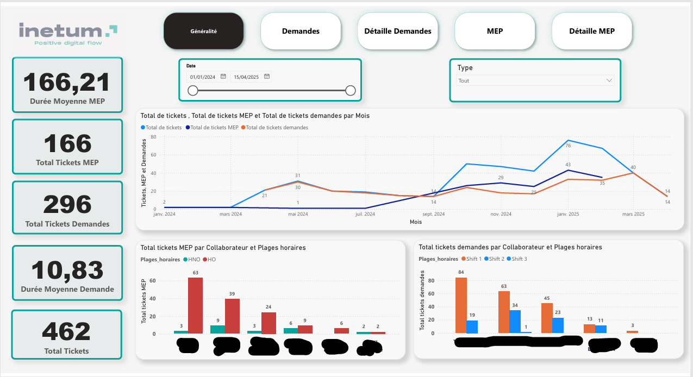  

 **Demande Page:**

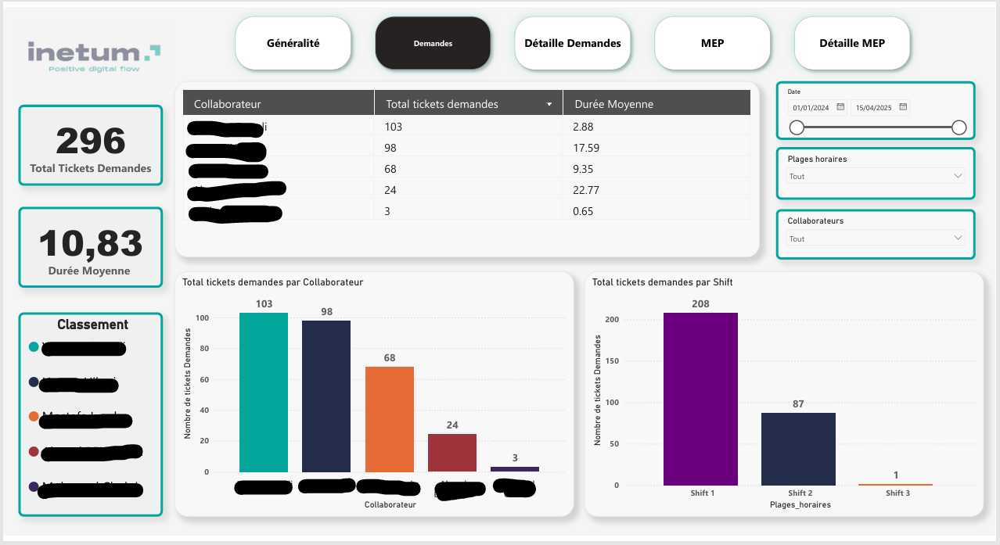  

 **Detaille Demande Page:**

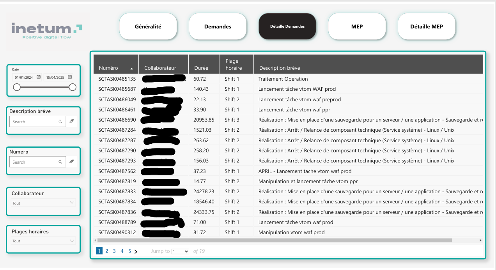 

**Mep Page:**

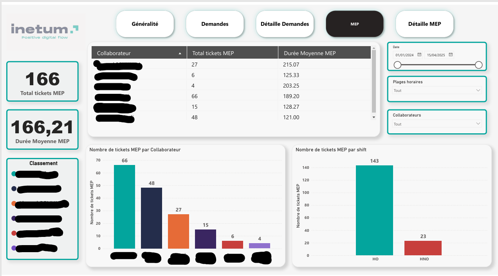 

**Detaille mep Page:**

 

---

📌 **Example of Mep&Demandes Dashboard:**
     
 **home Page:**

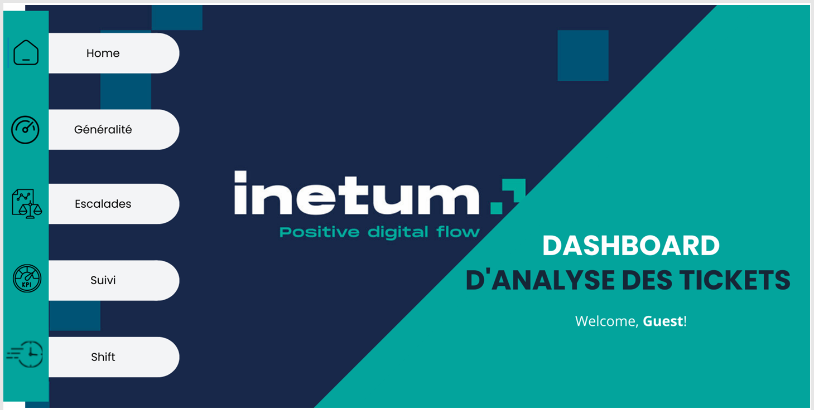 

 **General Page:**

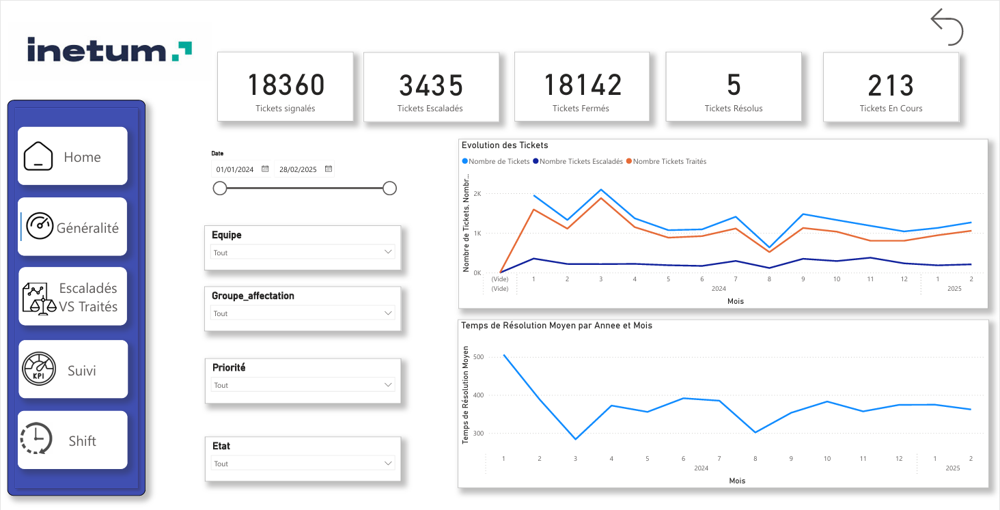

**Escalad Page:**

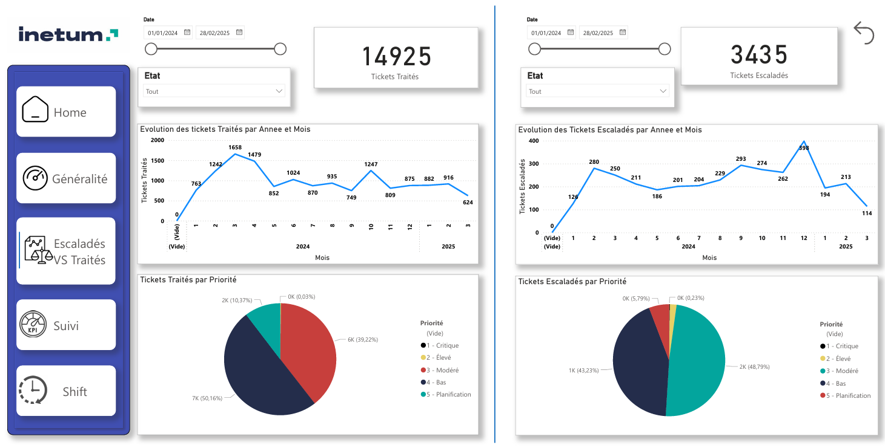

**Suivi Page:**

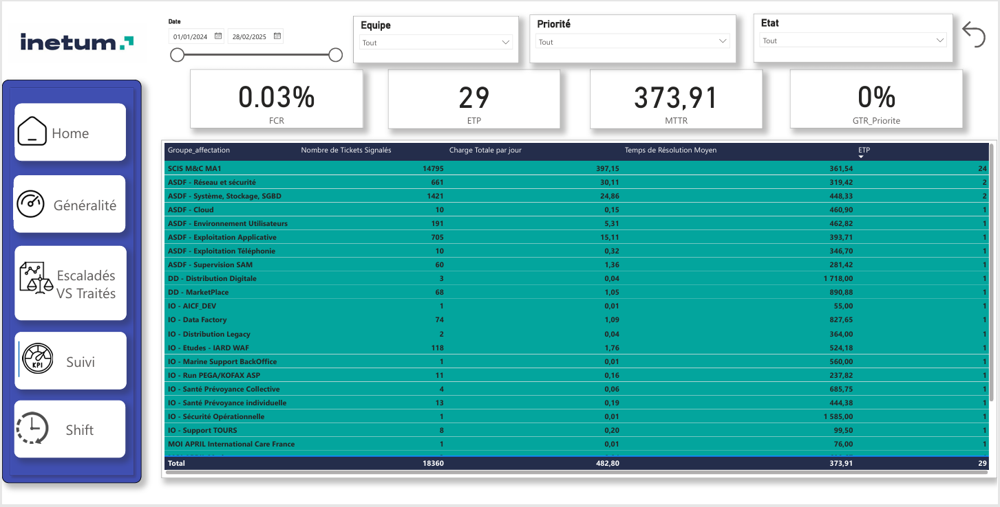

**Shift Page:**

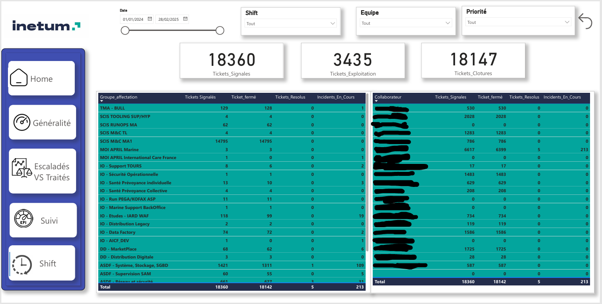

#### Medallion Architecture Diagram  
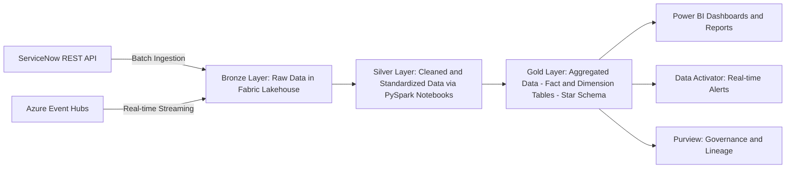
---
### Results/Findings
* Enabled **real-time monitoring** of ServiceNow incidents.
* Reduced reporting latency from hours to near real-time.
* Provided clear visibility into SLA performance and ticket workload distribution.
---
### Recommendations
* Scale the pipeline to include multiple ServiceNow modules (e.g., change requests, problem management).
* Enhance real-time dashboards with predictive analytics (e.g., ticket resolution forecasting).
* Integrate proactive notifications for high-priority incidents.
---
### Limitations
* Requires stable API access and ServiceNow credentials.
* Real-time streaming depends on Azure Event Hub throughput configuration.
* Some historical data gaps may exist depending on API retention policies.
---
### References
1. Microsoft Fabric Documentation
2. ServiceNow REST API Documentation

---

## 📊 Dashboards  

Below are the dashboards built in **Power BI** from the transformed ServiceNow data:  

- [Dashboard - Supervision](dashboard_Supervision.pdf)  
- [Dashboard - Mep & Demandes](dashboard_Mep&Demandes.pdf)  

You can open these PDF files to explore the KPIs and visualizations.  

---

## 👩‍💻 Author  

**Rania Alayachi**  
📧 alayachi.rania23@gmail.com  
🔗 [LinkedIn Profile](https://www.linkedin.com/in/rania-al-ayachi/)  
